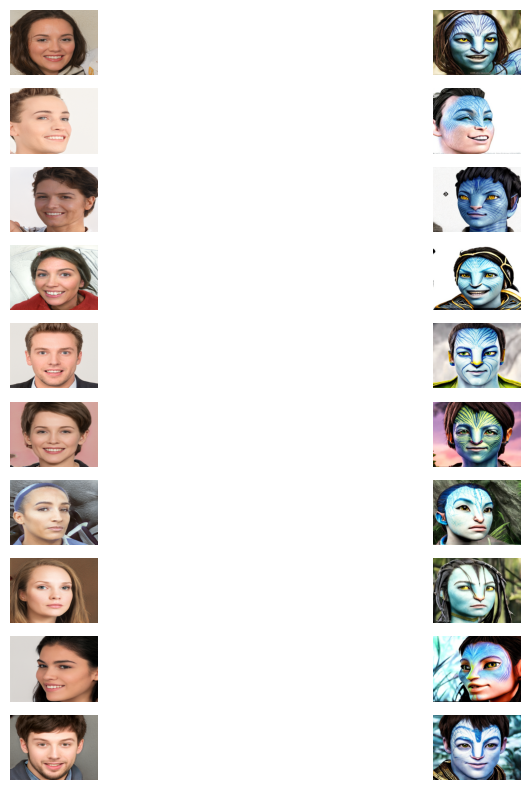

#### For Few Days Only

Its running on Google vertex AI To facilitate testing of the code API, a temporary URL has been provided: https://0b18-35-239-173-124.ngrok-free.app/ This URL grants access to the code API for a limited duration. You can utilize this resource to test and evaluate the functionality and performance of the code API. Please note that the URL is subject to change or expire in the future.

#### Readme.md

This repository contains code for a FastAPI application that handles user authentication and image upload. The application allows users to sign up, login, and upload image files. It includes authentication using JWT (JSON Web Tokens) and stores user information in a SQLite database.

### PreqRequisties

- CUDA 11.8
- CUDNN

### Requirements

- Python 3.9 or higher
- FastAPI
- SQLAlchemy
- PyJWT
- Passlib
- FastAPI OAuth2
- Pydantic
- Torch
- Diffusers
- HuggingFace
- Requests
- Pillow

### Installation

1. Clone the repository:

   ```
   git clone https://github.com/maazullah96/Grace-Technology-Task.git
   ```

2. Change into the project directory:

   ```
   cd Grace-Technology-Task
   ```

3. Install the required dependencies:

   ```
   pip install -r requirements.txt
   ```

4. Run the application:
   ```
   uvicorn main:app --reload
   ```

### Models Used

- https://huggingface.co/stabilityai/stable-diffusion-2-depth

### API Endpoints

- `POST /signup`: Creates a new user. Requires a JSON body with `username` and `password` fields. Returns the created user's username.

- `POST /login`: Authenticates a user and returns an access token. Requires a JSON body with `username` and `password` fields. Returns the access token.

- `POST /uploadfile`: Uploads an image file. Requires a bearer token in the authorization header. The uploaded file must be a JPG or PNG file. Returns the converted image file as a response.

### Usage

1. Run the create_tables file first so there is no error of tables.

1. Sign up a new user by sending a POST request to `/signup` with a JSON body containing the `username` and `password`.

1. Log in with the created user by sending a POST request to `/login` with a JSON body containing the `username` and `password`. The response will include an access token.

1. Use the access token to upload an image file by sending a POST request to `/uploadfile` with the image file as the request body. Make sure to include the access token in the authorization header as a bearer token.

### Example

Here's an example on how to use the API endpoints using `curl`:

1. Sign up:

   ```
   curl -X POST -H "Content-Type: application/json" -d '{"username":"your_username", "password":"your_password"}' http://localhost:8000/signup
   ```

2. Log in:

   ```
   curl -X POST -H "Content-Type: application/json" -d '{"username":"your_username", "password":"your_password"}' http://localhost:8000/login
   ```

3. Upload an image:
   ```
   curl -X POST -H "Authorization: Bearer <access_token>" -F "file=@image.jpg" http://localhost:8000/uploadfile
   ```

Note: Replace `<access_token>` with the actual access token obtained from the login response, and `image.jpg` with the path to the image file you want to upload.

### Notes

- This code provides a basic implementation of user authentication and image upload. It can be extended and customized according to your specific requirements.

- Make sure to set the `SECRET_KEY` and `ALGORITHM` variables in the code to secure your JWT tokens.

- The uploaded image is converted using the `StableDiffusionDepth2ImgPipeline` from the `diffusers` library. The converted image is returned as the response.

- The application uses a SQLite database to store user information. You can change the database URL in the code if needed.

- This readme file is a general guide to help you understand the code and its usage. Feel free to modify it as per your project requirements.

### Results

- Prompt Used

```
Generate a high-resolution image that faithfully represents the iconic characters from the movie 'Avatar'. Pay special attention to the unique facial features, including the expressive eyes and high cheekbones of the Na'vi race. Capture the intricate details of the blue skin, including tone, texture, and the glow of bioluminescent markings. Create a visually stunning and lifelike representation that showcases the flowing, braided hair and tribal-inspired clothing and accessories of the Na'vi characters.

```


